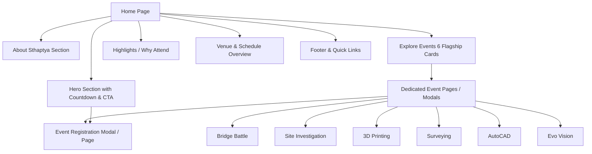

# 🏛️ STHAPATYA 2026–27 — Project Vision & Concept (`idea.md`)

## 1. Overview
**STHAPATYA 2026–27** is the flagship annual technical symposium organized by the **Civil Engineering Students Association (CiESA)** at **Pimpri Chinchwad College of Engineering (PCCOE)**, Pune. Scheduled for **9th – 10th October 2026**, it brings together engineering students, innovators, and problem-solvers across colleges to test their technical intellect, investigative skills, and practical engineering capabilities.

---

## 2. Core Objectives
- **Showcase Technical & Practical Mastery:** Provide a high-energy platform for students through hands-on competitions, treasure hunts, design challenges, and practical tests.
- **Drive High Engagement & Frictionless Registrations:** Deliver a smooth digital portal with dual fee structures (Free for PCCOE students, flat fee for other colleges) and instant verification.
- **Brand Prestige for CiESA & PCCOE:** Project STHAPATYA as a premier college technical symposium with a modern blueprint/structural aesthetic.

---

## 3. Target Audience & Personas
1. **Engineering Participants (Civil, Architecture & Allied):** Looking for competitive challenge, prize money, certificates, and recognition.
2. **First-time Attendees / Juniors:** Need clear event rules, schedules, team limits, and easy onboarding without friction.
3. **Faculty & Organizers:** Require organized lead capture, team member lists, and smooth coordination.
4. **Sponsors & Guests:** Looking for a polished, legitimate, and impressive event portal.

---

## 4. Key Value Propositions
- **Clarity First:** Instead of cramming all event guidelines onto one overwhelming homepage, individual event pages provide clear, modular details with one-click registration.
- **Dynamic Structural Theme:** A visual design reflecting civil engineering principles—blueprint grids, tensile lines, geometric structures, modern steel & concrete textures, coupled with high-tech glowing accents.
- **Zero-Friction Registration:** Direct registration pipeline with team composition validation, fee breakdowns, and clear confirmation flows.

---

## 5. Information Architecture & Page Map

---

## 6. Website Feature Matrix

| Feature | Purpose & User Benefit | Priority |
| :--- | :--- | :--- |
| **Dynamic Hero Section** | Bold headline, college/department branding, event dates, venue, and live countdown timer | P0 (Must Have) |
| **Concise About Section** | Fast narrative highlighting the spirit and history of Sthaptya | P0 (Must Have) |
| **Interactive Event Grid** | 6 distinct event cards with quick specs (team size, duration, prize pool) and instant details trigger | P0 (Must Have) |
| **Dedicated Event Details View** | Deep-dive pages/views for each event: rules, equipment, venue, coordinator contacts, and direct register CTA | P0 (Must Have) |
| **Unified Registration Hub** | Centralized registration flow supporting solo & team signups, payment receipt uploads, or linked Google Forms | P0 (Must Have) |
| **Live Countdown & Status Badge** | Real-time countdown to event opening; dynamic badges (e.g., "Registration Open", "Limited Slots") | P1 (High) |
| **Sponsorship & Schedule Timeline** | Visual schedule tracker (Day 1 / Day 2) and venue navigation map | P1 (High) |
| **FAQ & Coordinator Contacts** | Instant answers regarding accommodation, eligibility, certificates, and direct coordinator hotlines | P1 (High) |

---

## 7. Success Metrics
- 🚀 **Zero Drop-off:** Easy discovery to registration within 2 clicks from the homepage.
- 📱 **Mobile Responsiveness:** Flawless rendering on mobile devices (where >70% of student traffic originates).
- ⚡ **Performance:** Under 1.5s load time, lightweight assets, crisp vector icons, and smooth 60fps animations.
