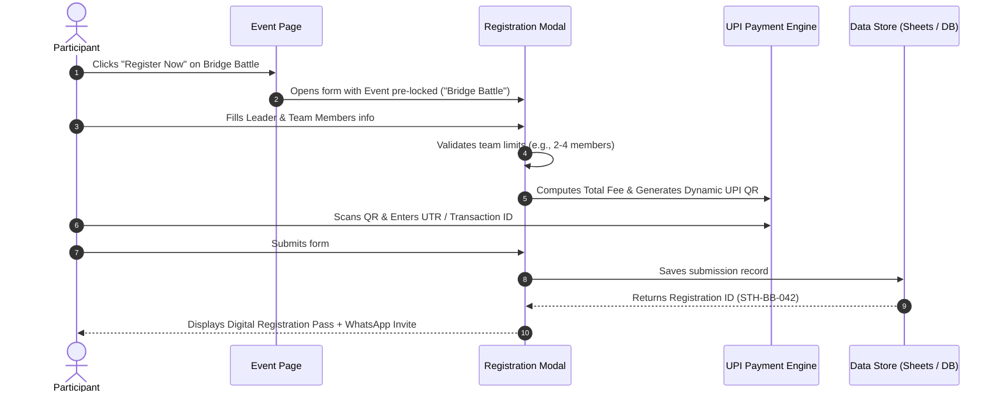

# 📝 Registration System Specification (`registration.md`)

## 1. System Goals
The registration system must eliminate student friction, prevent data entry errors, support both solo and multi-member team registrations, and provide instant confirmation with registration IDs.

---

## 2. Recommended Architecture Options

### Option A: Integrated In-Site Modal with Backend / Sheets (Recommended ⭐)
- **User Experience:** Instant popup or dedicated page without leaving the website.
- **Data Destination:** Google Sheets API, Supabase, Airtable, or Firebase Firestore.
- **Payment Handling:** Dynamic UPI QR Code (Google Pay / PhonePe / Paytm) with calculated fee amount + UTR / Transaction ID proof submission.
- **Confirmation:** Instant digital pass with Unique Registration ID (e.g., `STH-BB-2026-042`) and WhatsApp group link.

### Option B: Quick Google Form Routing
- Direct links on each event card/page pointing to pre-configured Google Forms with pre-filled event parameters.
- Very fast to deploy, zero maintenance.

---

## 3. Registration Data Model

### Field Specifications
```json
{
  "registration_id": "STH-2026-BB-042",
  "timestamp": "2026-09-22T21:35:00Z",
  "event_id": "bridge-battle",
  "event_name": "Bridge Battle",
  "team_name": "Truss Titans",
  "lead_student": {
    "full_name": "Alex Johnson",
    "email": "alex.j@college.edu",
    "phone": "+91 9876543210",
    "college": "National Institute of Technology",
    "department": "Civil Engineering",
    "year_of_study": "3rd Year",
    "id_card_number": "CIV2023089"
  },
  "team_members": [
    {
      "member_number": 2,
      "full_name": "Priya Sharma",
      "college": "National Institute of Technology",
      "phone": "+91 9876501234"
    },
    {
      "member_number": 3,
      "full_name": "Rohan Verma",
      "college": "National Institute of Technology",
      "phone": "+91 9876598765"
    }
  ],
  "payment": {
    "amount_due": 150,
    "status": "Pending Verification",
    "transaction_id_utr": "426189304128",
    "receipt_url": "https://storage.../receipts/sth_bb_042.jpg"
  },
  "terms_accepted": true
}
```

---

## 4. UI/UX Flow



---

## 5. Form Validation Rules
1. **Dynamic Member Fields:** If the selected event has a team size of `1`, hide team member fields. If `2-4`, let the user click `+ Add Member` up to the max limit.
2. **Phone Number:** Exactly 10 digits (Indian mobile numbers: `^[6-9]\d{9}$`).
3. **Email:** Standard RFC email syntax.
4. **UTR / Ref ID:** Alphanumeric / 12-digit UPI transaction reference validation to prevent blank or dummy entries.
5. **Duplicate Check:** Prevent duplicate registration for the same lead email and phone in the same event.

---

## 6. Post-Registration Experience
- **Digital Registration Pass:** Displays participant name, QR code with registration ID, event title, reporting date & time, venue, and reporting guidelines.
- **WhatsApp Group Automation:** Direct button `"Join Event WhatsApp Group"` so participants instantly receive live updates, rule clarifications, and schedule notifications.
- **Save Pass as Image / PDF:** Easy 1-click download for presentation at the registration desk on the event day.
